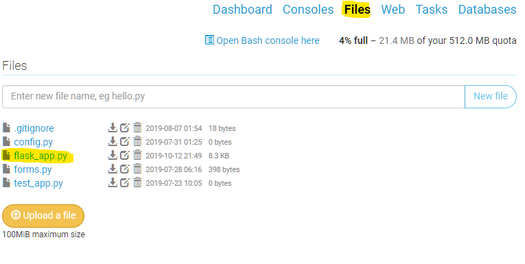

# Flask-Login
Flask-Login provides user session management for Flask. It handles the common
tasks of logging in, logging out, and remembering your users' sessions over
extended periods of time.

Flask-Login is not bound to any particular database system or permissions
model. The only requirement is that your user objects implement a few methods,
and that you provide a callback to the extension capable of loading users from
their ID.

## Usage

Once installed, the Flask-Login is easy to use. Let's walk through setting up
a basic application. Also please note that this is a very basic guide: we will
be taking shortcuts here that you should never take in a real application.

To begin we'll set  open our Flask app:



Flask-Login handles the bulk of the complex work via a login manager. 
To kick things off, we'll set up the login manager by instantiating 
it and telling it about our Flask app:

```python
import flask_login  #imports the flask_login code

#creates a login_manager from flask_login. 
login_manager = flask_login.LoginManager()

#initialises the login_manager using information from the flask application
login_manager.init_app(app)
```


For simplicity sakes, we are going to use a dictionary to represent a database of users. 
In a real application this would be an actual database object as we saw from last term.
However it's important to point out this is a feature of Flask-Login: it
doesn't care how your data is stored so long as you tell it how to retrieve it!

```python
# Our mock database.
users = {'foo@bar.tld': {'password': 'secret'}}
```

We also need to tell Flask-Login how to load a user from a Flask request and
from its session. To do this we need to define our user object, a
`user_loader` callback, and a `request_loader` callback.

```python
class User(flask_login.UserMixin):
    '''
    All of the magic happens in flask_login.UserMixin
    '''
    pass


@login_manager.user_loader
def user_loader(email):
    '''
    Checks to see if the email address is in the users dictionary. 
    If not, it returns nothing and if there is, it creates a User Object. 
    '''
    if email not in users:
        return

    user = User()
    user.id = email
    return user


@login_manager.request_loader
def request_loader(request):
    '''
    This grabs a user based off of a request from a webpage. 
    '''
    email = request.form.get('email') # get the email from a template form
    if email not in users:
        return

    user = User()
    user.id = email

    # DO NOT ever store passwords in plaintext and always compare password
    # hashes using constant-time comparison!
    if request.form['password'] == users[email]['password']:
        flask_login.login_user(user)
        return user

    return None
```

Now we're ready to define our templates. We can start with a login templates, which will
populate the session with authentication bits. After that we can define a template
that requires authentication.

```python
@app.route('/auth', methods=['GET', 'POST'])
def auth():
    if request.method == 'GET':
        return '''
               <form action='login' method='POST'>
                <input type='text' name='email' id='email' placeholder='email'/>
                <input type='password' name='password' id='password' placeholder='password'/>
                <input type='submit' name='submit'/>
               </form>
               '''
    email = request.form['email']
    if request.form['password'] == users[email]['password']:
        user = User()
        user.id = email
        flask_login.login_user(user)
        return redirect(url_for('protected'))
    return 'Bad Login'


@app.route('/protected')
@flask_login.login_required
def protected():
    return 'Logged in as: ' + flask_login.current_user.id
```

Finally we can define a template to clear the session and log users out:

```python
@app.route('/logout')
def logout():
    flask_login.logout_user()
    return 'Logged out'
```

We now have a basic working application that makes use of session-based
authentication. To round things off, we should provide a callback for login
failures:

```python
@login_manager.unauthorized_handler
def unauthorized_handler():
    return 'Unauthorized'
```
